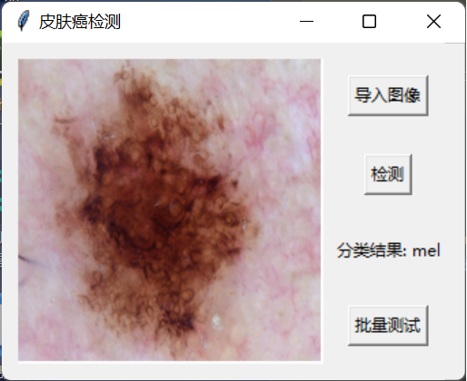

# Skin-cancer-system
# Deep Learning-Based Skin Cancer Recognition

**Author**: Shuhan Chen  
**Date**: 2023 
**Project Type**: Coursework (MEF204TC Artificial Intelligence and Data Analysis)

## 📜 Abstract
Skin cancer is a prevalent disease with a high global incidence rate. Early diagnosis and treatment are crucial for reducing morbidity and mortality. This project presents a practical implementation of a **deep learning-based approach** for recognizing skin cancer using the **HAM10000 dataset**. The framework includes three primary modules:
1. **Data Preprocessing**
2. **Model Training**
3. **Image Detection**

This study contributes to the field of medical image analysis by providing a user-friendly and efficient tool for skin cancer recognition, which has the potential to assist dermatologists in their clinical practice.

## 🔑 Keywords
- Deep Learning
- Convolutional Neural Networks (CNN)
- MobileNetV2
- Skin Cancer Detection

---

## 🛠️ Methodology
### 1. Data Preprocessing
- The **HAM10000 dataset**, consisting of 10,000 dermatoscopic images, was used.
- **Preprocessing Techniques**:
  - Converted images to grayscale.
  - Applied **histogram equalization** to enhance contrast.

### 2. Model Training
- Utilized **MobileNetV2** with pre-trained **ImageNet weights**.
- Applied **data augmentation** (rotation, zoom, shifts, and flips) to enhance model generalization.
- The model was trained using the **Adam optimizer** with a learning rate of 1e-4.

### 3. Image Detection
- Developed a **Graphical User Interface (GUI)** using Python’s **Tkinter** library.
- The GUI allows users to:
  - Import skin lesion images.
  - Classify lesions.
  - Display results and evaluate batch testing performance.

## 📊 Results
- **Performance Metrics**: Accuracy, Precision, Recall, F1-Score.
- The overall **F1-score** of the model was **0.91**, indicating high classification accuracy.

| Class       | Precision | Recall | F1-score | Support |
|-------------|-----------|--------|----------|---------|
| Class 1     | 0.90      | 0.92   | 0.91     | 100     |
| Class 2     | 0.85      | 0.83   | 0.84     | 100     |
| Class 3     | 0.88      | 0.86   | 0.87     | 100     |
| Class 4     | 0.92      | 0.94   | 0.93     | 100     |
| Class 5     | 0.95      | 0.97   | 0.96     | 100     |
| Class 6     | 0.91      | 0.89   | 0.90     | 100     |
| Class 7     | 0.94      | 0.96   | 0.95     | 100     |
| **Overall** |           |        | **0.91** | **700** |

**Figure**: Example of the GUI for skin lesion classification, displaying the input image, predicted class, and prediction probability.

---

## 🖼️ GUI Demonstration


*Figure: Graphical User Interface for skin lesion classification allowing real-time interaction.*

---

## 🔍 Literature Review
- **Esteva et al. (2017)** demonstrated that **CNNs** could achieve dermatologist-level classification of skin cancer, outperforming several board-certified dermatologists ([source](https://www.nature.com/articles/nature21056)).
- **Ronneberger et al. (2015)** introduced **U-Net**, a successful CNN architecture for biomedical image segmentation, laying the foundation for deep learning applications in skin lesion analysis.

---

## 🖥️ Future Work
1. **Expand Dataset**: Train the model on larger, more diverse datasets for improved generalization.
2. **Transfer Learning**: Explore additional pre-trained models like **ResNet**, **Inception**, and **EfficientNet**.
3. **Model Explainability**: Use techniques such as **Grad-CAM** or **LIME** to provide better model transparency.
4. **Real-Time Classification**: Develop a real-time classification system using smartphone cameras.
5. **Multimodal Data Integration**: Integrate additional data sources like demographic information, medical history, or genetic data.

---

## 📖 References
1. Esteva, B., et al. "Dermatologist-level classification of skin cancer with deep neural networks." *Nature*, 2017. [Link](https://www.nature.com/articles/nature21056)
2. Ronneberger, O., et al. "U-Net: Convolutional networks for biomedical image segmentation." *MICCAI*, 2015. [Link](https://link.springer.com/chapter/10.1007%2F978-3-319-24574-4_28)

---

## 🤝 Acknowledgements
- Special thanks to Professor [Advisor's Name] for their guidance and support throughout this project.
- Thanks to the creators of the **HAM10000 dataset** and to the developers of **TensorFlow**, **Keras**, and other open-source libraries for providing powerful tools for machine learning research.

## 📂 Repository Contents
- **docs/**: Research documentation.
- **notebooks/**: Jupyter notebooks for data preprocessing, model training, and evaluation.
- **src/**: Python scripts for data handling and GUI.
- **images/**: Images related to the project (GUI screenshots, charts).

---

## 📥 Download the Full Report
[](skin_cancer_gui.png)

---

## ✨ How to Use
1. **Clone this repository**: 
   ```sh
   git clone https://github.com/username/skin-cancer-recognition.git
